# DevOps Task API

Projeto acadêmico individual da disciplina **DevOps na Prática**.

Este README documenta as duas fases do projeto:

- **Fase 1 — Configuração e Automação Inicial** (seções abaixo, preservadas integralmente).
- **[Fase 2 — Entrega Contínua, Monitoramento e Segurança](#fase-2--entrega-contínua-monitoramento-e-segurança)** (nova seção ao final deste documento).

## Descrição

A **DevOps Task API** é uma API REST simples para gerenciamento de tarefas (criação e listagem), construída em **Node.js** com **Express**. Os dados são armazenados **em memória** (sem banco de dados e sem serviços pagos), com o objetivo de manter o foco da Fase 1 nos fundamentos de configuração, automação, containerização, infraestrutura como código e integração contínua.

## Objetivos

- Construir uma aplicação simples, testável e bem estruturada.
- Separar a configuração da aplicação (`src/app.js`) da inicialização do servidor (`src/server.js`), permitindo testes automatizados sem subir uma porta real.
- Cobrir os principais fluxos com testes automatizados (Jest + Supertest).
- Containerizar a aplicação com um Dockerfile enxuto e seguro.
- Provisionar a infraestrutura local (container) via Terraform, usando o provider Docker.
- Automatizar testes e validação de infraestrutura por meio de um pipeline de CI no GitHub Actions.

## Tecnologias

- **Node.js** (>= 18)
- **Express** — framework HTTP
- **Jest** — framework de testes
- **Supertest** — testes de integração HTTP
- **Docker** — containerização
- **Terraform** (>= 1.5) + provider **kreuzwerker/docker**
- **GitHub Actions** — pipeline de CI

## Estrutura do projeto

```
DevOps/
├── src/
│   ├── app.js               # Configuração da aplicação Express (rotas, middlewares)
│   └── server.js             # Inicialização do servidor HTTP (lê PORT do ambiente)
├── tests/
│   └── app.test.js           # Testes automatizados (Jest + Supertest)
├── infra/
│   ├── main.tf                # Recursos Terraform (build via Docker CLI + container Docker)
│   ├── variables.tf           # Variáveis de entrada do Terraform
│   └── outputs.tf             # Outputs (URL local da API, id do container)
├── .github/
│   └── workflows/
│       └── ci.yml             # Pipeline de CI (testes + validação Terraform)
├── Dockerfile                 # Build da imagem da aplicação
├── .dockerignore
├── .gitignore
├── package.json
└── README.md
```

## Pré-requisitos

- [Node.js](https://nodejs.org/) 18 ou superior e npm
- [Docker](https://www.docker.com/) (opcional, para build/execução em container)
- [Terraform](https://developer.hashicorp.com/terraform/downloads) >= 1.5 (opcional, para provisionar via IaC)

## Instalação

```bash
npm install
```

## Execução local

```bash
npm start
```

Por padrão a API sobe na porta `3000`. Para usar outra porta:

```bash
PORT=4000 npm start
```

### Endpoints disponíveis

| Método | Rota      | Descrição                                             |
|--------|-----------|--------------------------------------------------------|
| GET    | `/health` | Retorna `200` com o status do serviço                  |
| GET    | `/tasks`  | Retorna a lista de tarefas cadastradas                  |
| POST   | `/tasks`  | Cria uma tarefa (`title` obrigatório, `description` opcional) |

Exemplo de criação de tarefa:

```bash
curl -X POST http://localhost:3000/tasks \
  -H "Content-Type: application/json" \
  -d '{"title": "Estudar Terraform", "description": "Ler documentação do provider Docker"}'
```

Requisição sem `title` retorna `400`:

```bash
curl -i -X POST http://localhost:3000/tasks \
  -H "Content-Type: application/json" \
  -d '{"description": "Sem título"}'
```

## Testes

Os testes cobrem:

- `GET /health` retorna `200`;
- `GET /tasks` retorna um array;
- `POST /tasks` com título válido retorna sucesso (`201`);
- `POST /tasks` sem título retorna `400` com mensagem de erro.

Executar localmente:

```bash
npm test
```

Executar em modo CI (com relatório de cobertura, sem watch):

```bash
npm run test:ci
```

## Docker

### Build da imagem

```bash
docker build -t devops-task-api:local .
```

### Executar o container

```bash
docker run --rm -p 3000:3000 devops-task-api:local
```

A API estará disponível em `http://localhost:3000`.

Boas práticas aplicadas no `Dockerfile`:
- Imagem base `node:20-alpine` (enxuta);
- Instalação de apenas dependências de produção (`npm ci --omit=dev`);
- Cópia seletiva de arquivos (sem `node_modules`, testes, infra, etc. via `.dockerignore`);
- Execução do processo com usuário não-root (`node`).

## Terraform

A infraestrutura provisiona um container Docker local a partir da imagem da aplicação, expõe a porta `3000` e retorna a URL local da API como output.

### Estratégia de build da imagem

O provider `kreuzwerker/docker` oferece um mecanismo de build embutido (bloco `build` dentro do resource `docker_image`), mas esse mecanismo depende de `pigz`/`unpigz` para descompactar o contexto de build enviado ao daemon Docker. Em algumas instalações do Docker Desktop no macOS isso resulta na falha:

```
Error running legacy build: failed to read dockerfile:
unpigz: skipping: <stdin>: corrupted — incomplete deflate data
```

Para evitar essa incompatibilidade, a build da imagem **não** é feita pelo provider. Em vez disso:

1. Um resource `terraform_data` executa `docker build` diretamente via Docker CLI (provisioner `local-exec`), usando a raiz do projeto (um nível acima de `infra/`) como contexto de build. O build é reexecutado sempre que `Dockerfile`, `package.json`, `package-lock.json`, `src/app.js` ou `src/server.js` mudam (via `triggers_replace`).
2. O data source `docker_image` localiza, no daemon Docker local, a imagem `devops-task-api:latest` já construída pelo passo anterior.
3. O `docker_container` usa o `id` dessa imagem (`data.docker_image.app.id`) para subir o container.

Ou seja: o Terraform continua sendo a ferramenta de orquestração de toda a infraestrutura local, mas delega o build da imagem ao Docker CLI (o mesmo comando validado manualmente com `docker build -t devops-task-api .`) e depois provisiona o container através do provider Docker. Essa abordagem não depende de nuvem, registry remoto ou credenciais — tudo roda localmente.

### Comandos

```bash
cd infra

terraform init
terraform fmt
terraform validate
terraform plan
terraform apply
```

Após o `apply`, o output `api_url` mostrará o endereço local da API (por padrão, `http://localhost:3000`).

### Remover a infraestrutura

```bash
cd infra
terraform destroy
```

> Requer o Docker em execução na máquina local, pois o provider `kreuzwerker/docker` se conecta ao daemon Docker local.

## Explicação do pipeline de CI

O workflow `.github/workflows/ci.yml` é executado em `push` e `pull_request` para a branch `main`, com dois jobs independentes:

1. **`test` — Testes da aplicação**
   - Faz checkout do código;
   - Configura o Node.js 20;
   - Executa `npm ci` (instalação determinística das dependências);
   - Executa `npm test` (suíte Jest/Supertest).

2. **`terraform` — Validação do Terraform**
   - Faz checkout do código;
   - Configura o Terraform;
   - Executa `terraform fmt -check -recursive` (garante formatação padronizada);
   - Executa `terraform init -backend=false` (inicializa sem exigir backend remoto/credenciais);
   - Executa `terraform validate` (valida sintaxe e consistência da configuração).

Nenhum credencial, token ou segredo é utilizado no pipeline — o job de Terraform apenas valida a configuração estaticamente, sem realizar `apply` em nuvem.

## Comandos necessários (resumo rápido)

```bash
# Instalação e testes
npm install
npm test
npm run test:ci

# Execução local
npm start

# Docker
docker build -t devops-task-api:local .
docker run --rm -p 3000:3000 devops-task-api:local

# Terraform
cd infra
terraform init
terraform fmt
terraform validate
terraform plan
terraform apply
terraform destroy
```

## Resultados esperados

- Todos os testes automatizados (`npm test`) devem passar (4 testes: health, listagem, criação válida, criação inválida).
- `GET /health` deve responder `200` com um JSON indicando que o serviço está ativo.
- `POST /tasks` sem `title` deve responder `400` com uma mensagem de erro clara.
- A imagem Docker deve construir com sucesso e o container deve expor a API na porta `3000`.
- `terraform apply` deve criar o container da aplicação e exibir a URL local da API; `terraform destroy` deve removê-lo completamente.
- O pipeline de CI deve executar com sucesso em cada `push`/`pull request` para `main`, validando tanto o código da aplicação quanto a infraestrutura.

## Evidências

> Espaço reservado para inserir prints/registros da execução do projeto (a preencher pelo autor).

- [ ] Print da execução de `npm test` com todos os testes passando.
- [ ] Print do `curl`/Postman testando `GET /health`, `GET /tasks` e `POST /tasks`.
- [ ] Print do build e execução do container Docker (`docker build` / `docker run`).
- [ ] Print do `terraform apply` com o output `api_url` e do `terraform destroy`.
- [ ] Print do pipeline de CI executado com sucesso no GitHub Actions.

---

## Fase 2 — Entrega Contínua, Monitoramento e Segurança

Esta seção documenta exclusivamente o que foi adicionado na **Fase 2**. Tudo o que está descrito nas seções anteriores (aplicação, testes originais, Dockerfile, Terraform e o pipeline de CI de testes/validação) permanece **inalterado e funcional** — a Fase 2 expande a arquitetura por cima da base da Fase 1, sem removê-la ou descaracterizá-la.

### Arquitetura da Fase 2

```
DevOps/
├── src/
│   ├── app.js               # Express + Helmet + logging (pino-http) + métricas + rotas
│   ├── metrics.js            # [NOVO] Registro Prometheus e middleware de coleta de métricas HTTP
│   └── server.js
├── tests/
│   └── app.test.js           # Testes originais + testes de /metrics e headers do Helmet
├── infra/                     # Terraform da Fase 1 — inalterado
├── monitoring/
│   └── prometheus.yml         # [NOVO] Configuração de scrape do Prometheus
├── scripts/                   # [NOVO] Scripts de deploy/operação
│   ├── deploy.sh
│   ├── stop.sh
│   ├── logs.sh
│   └── status.sh
├── .github/workflows/
│   └── ci.yml                 # Expandido: audit, docker (build+scan+smoke), cd (GHCR)
├── compose.yaml                # [NOVO] Orquestração local (app + prometheus)
├── .env.example                 # [NOVO] Configurações não sensíveis de exemplo
├── Dockerfile                   # Fase 1 — inalterado
└── README.md
```

A aplicação continua sendo a mesma API em memória da Fase 1. O que muda é tudo o que envolve **entregar, observar e proteger** essa aplicação: um endpoint de métricas, logging estruturado, headers de segurança, orquestração via Docker Compose, scripts de operação e um pipeline que builda, escaneia, testa e publica a imagem no GitHub Container Registry.

### Diferença entre CI e CD neste projeto

- **CI (Integração Contínua)** roda em **todo push/pull request para `main`** e é puramente de *validação*: instala dependências, executa os testes (Jest/Supertest), audita dependências de produção (`npm audit`), valida o Terraform (`fmt`, `init`, `validate`), builda a imagem Docker, escaneia a imagem com Trivy e roda um smoke test do container. Nenhum artefato é publicado nessa etapa.
- **CD (Entrega Contínua)** roda **apenas em push para `main`** e **apenas depois que todos os jobs de CI passam** (`needs: [test, audit, terraform, docker]`). O único efeito do CD é publicar a imagem Docker já validada no GitHub Container Registry (GHCR), com as tags `latest` e o SHA do commit.

Chamamos isso de **entrega contínua**, e não de **implantação contínua**: o pipeline entrega a imagem pronta e versionada no registry, mas não a implanta automaticamente em nenhum ambiente de produção — isso é feito localmente (ou em qualquer host com Docker) via `docker compose` ou os scripts em `scripts/`, mantendo o projeto livre de qualquer serviço pago de nuvem.

### Monitoramento

- Dependência: [`@prometheus-io/client`](https://github.com/prometheus/client_js) — o pacote oficial da organização Prometheus para Node.js (sucessor direto do `prom-client`, hoje descontinuado).
- [`src/metrics.js`](src/metrics.js) cria um `Registry` próprio, ativa as métricas padrão do processo Node.js (`collectDefaultMetrics`) e define:
  - `http_requests_total` (Counter) — quantidade de requisições, com labels `method`, `route` e `status_code`;
  - `http_request_duration_seconds` (Histogram) — duração das requisições, com os mesmos labels.
- O label `route` usa o padrão de rota do Express (`req.route.path`, ex.: `/tasks`), nunca a URL bruta recebida — isso evita cardinalidade alta e vazamento de dados sensíveis (IDs, querystrings, etc.) nas labels.
- `GET /metrics` (definido em [`src/app.js`](src/app.js)) expõe as métricas no formato de exposição do Prometheus (`text/plain; version=0.0.4`).
- [`monitoring/prometheus.yml`](monitoring/prometheus.yml) configura o Prometheus (serviço `prometheus` no Compose) para coletar (`scrape`) o endpoint `app:3000/metrics` a cada 15 segundos.

### Logging

- Dependência: [`pino`](https://github.com/pinojs/pino) + [`pino-http`](https://github.com/pinojs/pino-http) — logger estruturado em JSON, leve e ativamente mantido.
- Cada requisição gera uma linha de log em `stdout` contendo `method`, `url` (rota), `statusCode`, `responseTime` (ms) e `time` (timestamp).
- Serializers customizados restringem o conteúdo logado a `{ method, url }` na requisição e `{ statusCode }` na resposta — **headers (incluindo `Authorization`), bodies, cookies, tokens e senhas nunca são logados**.
- Nível de log configurável via `LOG_LEVEL` (`.env.example`); em ambiente de teste (`NODE_ENV=test`) o logger fica silencioso para não poluir a saída do Jest.
- Como a aplicação sempre loga em `stdout`/`stderr`, os logs podem ser consultados com `docker compose logs app` ou `docker logs <container>`.

### Segurança da aplicação

- [`helmet`](https://github.com/helmetjs/helmet) aplicado como o primeiro middleware do Express, adicionando headers como `Content-Security-Policy`, `X-Content-Type-Options: nosniff`, `X-Frame-Options`, `Strict-Transport-Security`, entre outros.
- O container continua executando como o usuário não-root `node` (herdado do Dockerfile da Fase 1, que não foi alterado).
- Nenhum segredo é adicionado ao código-fonte. `.env` real permanece listado em [`.gitignore`](.gitignore) (já ignorado desde a Fase 1); apenas [`.env.example`](.env.example), com valores de exemplo não sensíveis, é versionado.
- `npm audit --omit=dev` roda no CI (job `audit`) para detectar vulnerabilidades nas dependências de produção.
- A imagem Docker é escaneada pelo Trivy no CI (job `docker`), com política dupla:
  - uma passada de **relatório** (`severity: HIGH,CRITICAL`, `exit-code: 0`) que apenas lista as vulnerabilidades encontradas, sem falhar o pipeline;
  - uma passada que **falha o pipeline** apenas para vulnerabilidades **CRITICAL com correção disponível** (`severity: CRITICAL`, `exit-code: 1`, `ignore-unfixed: true`) — assim, CVEs sem correção publicada (comuns em imagens base) não tornam o projeto inutilizável, mas uma vulnerabilidade crítica corrigível bloqueia a entrega.

### Testes

Os 4 testes originais da Fase 1 foram preservados e passam sem alteração. Foram adicionados em [`tests/app.test.js`](tests/app.test.js):

- `GET /metrics` retorna `200`;
- `GET /metrics` retorna conteúdo compatível com o formato do Prometheus (`Content-Type: text/plain`, presença de linhas `# HELP`/`# TYPE` e das métricas `http_requests_total` / `http_request_duration_seconds`);
- headers de segurança do Helmet (`X-Content-Type-Options`, `X-DNS-Prefetch-Control`) presentes nas respostas;
- os testes de `GET /health`, `GET /tasks` e `POST /tasks` (válido e inválido) continuam cobrindo os endpoints originais.

```bash
npm test        # 7 testes, todos passando
npm run test:ci # mesma suíte, com relatório de cobertura, modo CI
```

### Docker Compose / Orquestração

[`compose.yaml`](compose.yaml) orquestra dois serviços na mesma rede (criada automaticamente pelo Compose):

| Serviço      | Imagem                          | Porta externa            | Observações                                                              |
|--------------|----------------------------------|---------------------------|---------------------------------------------------------------------------|
| `app`        | build local do `Dockerfile`      | `${APP_PORT:-3000}` → 3000 | `PORT=3000`, healthcheck HTTP em `/health`, `restart: unless-stopped`    |
| `prometheus` | `prom/prometheus:v3.13.3` (oficial) | `9090` → 9090             | Monta `monitoring/prometheus.yml`, só inicia depois que `app` fica saudável (`depends_on: condition: service_healthy`) |

Nenhum banco de dados, Redis, Grafana ou outro serviço além destes dois foi adicionado, conforme escopo da Fase 2.

> Nota: o container do serviço `app` recebe o nome `devops-task-api-app` (e não `devops-task-api`) para não colidir com o container homônimo já gerenciado pelo Terraform da Fase 1 (`docker_container.app` em `infra/`). Terraform e Docker Compose provisionam a mesma aplicação por dois caminhos independentes e podem coexistir sem conflito.

### Scripts de deploy

Em [`scripts/`](scripts/), todos com `set -euo pipefail` e permissão de execução:

- **`deploy.sh`** — verifica se o Docker está disponível e em execução, detecta `docker compose`/`docker-compose`, sobe os serviços (`up -d --build`), aguarda o container da aplicação ficar `healthy` (com timeout e exibição de logs em caso de falha) e faz um smoke test em `/health`, reportando sucesso ou falha claramente.
- **`stop.sh`** — encerra e remove os containers do projeto (`compose down`).
- **`logs.sh`** — exibe os logs dos serviços em tempo real (`compose logs -f --tail=100`), aceitando o nome de um serviço como argumento opcional (ex.: `./scripts/logs.sh app`).
- **`status.sh`** — mostra o status atual dos containers (`compose ps`).

### Gerenciamento de configurações

Configurações ficam centralizadas em variáveis de ambiente, documentadas em [`.env.example`](.env.example):

```bash
# Porta interna em que o processo Node.js escuta dentro do container
PORT=3000

# Porta externa exposta no host pelo Docker Compose
APP_PORT=3000

# Nível de log da aplicação (trace, debug, info, warn, error, fatal, silent)
LOG_LEVEL=info
```

Nunca versione um `.env` real — apenas o `.env.example`. Para uso local, copie-o:

```bash
cp .env.example .env
```

### Pipeline CI/CD ([`.github/workflows/ci.yml`](.github/workflows/ci.yml))

Continua disparando em `push` e `pull_request` para `main`, agora com 5 jobs:

1. **`test`** *(preservado da Fase 1)* — `npm ci` + `npm test`.
2. **`audit`** *(novo)* — `npm ci` + `npm audit --omit=dev --audit-level=high`: falha o pipeline se houver vulnerabilidade `HIGH` ou `CRITICAL` nas dependências de produção.
3. **`terraform`** *(preservado da Fase 1)* — `terraform fmt -check -recursive`, `terraform init -backend=false`, `terraform validate`.
4. **`docker`** *(novo, depende de `test`)* — builda a imagem com `docker/build-push-action@v7` (sem publicar), escaneia com `aquasecurity/trivy-action@v0.36.0` (relatório HIGH/CRITICAL + falha em CRITICAL corrigível) e executa um smoke test real do container (`docker run` → aguarda `/health` responder `200` → remove o container).
5. **`cd`** *(novo, depende de `test`, `audit`, `terraform` e `docker`)* — **somente em push para `main`**: autentica no GHCR com `docker/login-action@v4` usando `github.actor` e `secrets.GITHUB_TOKEN` (nenhum token manual é necessário), e publica a imagem com `docker/build-push-action@v7` em `ghcr.io/${{ github.repository }}`, com as tags `latest` e `${{ github.sha }}`. As permissões do job são restritas ao mínimo necessário:
   ```yaml
   permissions:
     contents: read
     packages: write
   ```

Todas as actions usam versões estáveis e fixas (majors atuais): `actions/checkout@v6`, `actions/setup-node@v7`, `hashicorp/setup-terraform@v4`, `docker/setup-buildx-action@v4`, `docker/build-push-action@v7`, `docker/login-action@v4` e `aquasecurity/trivy-action@v0.36.0` (nenhuma delas usa `:master`/`latest`).

### GitHub Container Registry (GHCR)

Após um merge/push em `main` com todos os jobs de CI verdes, a imagem fica disponível em:

```
ghcr.io/<owner>/<repo>:latest
ghcr.io/<owner>/<repo>:<sha-do-commit>
```

Por padrão os pacotes publicados via `GITHUB_TOKEN` em um repositório privado ficam privados; em um repositório público, o pacote pode ser tornado público nas configurações do pacote no GitHub, se desejado.

### Comandos de execução

```bash
# Instalação e testes (igual à Fase 1)
npm ci
npm test
npm run test:ci

# Deploy completo via Docker Compose (build + up + healthcheck + smoke test)
./scripts/deploy.sh

# Alternativa manual equivalente
docker compose up -d --build
docker compose config   # valida a configuração do compose
docker compose ps

# Ver status dos containers
./scripts/status.sh

# Acompanhar logs (Ctrl+C para sair)
./scripts/logs.sh
./scripts/logs.sh app       # apenas o serviço da aplicação
docker compose logs app     # equivalente direto

# Parar e remover os containers
./scripts/stop.sh
```

### Como acessar cada componente

- **API**: `http://localhost:3000` (ou `http://localhost:$APP_PORT` se customizado)
- **Health check**: `curl http://localhost:3000/health`
- **Métricas Prometheus**: `curl http://localhost:3000/metrics`
- **Prometheus (UI)**: [http://localhost:9090](http://localhost:9090) — em **Status → Targets**, o job `devops-task-api` deve aparecer com estado `UP`.

### Rollback usando uma tag de imagem anterior

Como cada build no `main` publica uma tag imutável com o SHA do commit, o rollback consiste em apontar para uma imagem anterior conhecida, sem precisar reverter código:

```bash
# 1. Descubra o SHA do commit estável anterior (ex.: pelo histórico do GitHub Actions/GHCR)
PREVIOUS_SHA=<sha-do-commit-anterior>

# 2. Baixe a imagem publicada com esse SHA
docker pull ghcr.io/<owner>/<repo>:${PREVIOUS_SHA}

# 3. Marque-a localmente como a imagem que o compose.yaml consome
docker tag ghcr.io/<owner>/<repo>:${PREVIOUS_SHA} devops-task-api:local

# 4. Suba o compose reaproveitando essa imagem, sem rebuildar
docker compose up -d --no-build
```

Para reverter o rollback, basta repetir o processo com a tag `latest` (ou o SHA da versão mais recente) e rodar `docker compose up -d --build` normalmente.

### Evidências esperadas (Fase 2)

- [ ] Print de `npm test` com os 7 testes passando (incluindo os 3 novos).
- [ ] Print de `curl http://localhost:3000/metrics` mostrando métricas no formato Prometheus.
- [ ] Print da aba **Status → Targets** do Prometheus em `http://localhost:9090` com o job `devops-task-api` em estado `UP`.
- [ ] Print de `docker compose ps` com os serviços `app` (healthy) e `prometheus` em execução.
- [ ] Print de `docker compose logs app` mostrando logs estruturados em JSON.
- [ ] Print da execução de `./scripts/deploy.sh` com a mensagem de sucesso do smoke test.
- [ ] Print do pipeline do GitHub Actions com os jobs `test`, `audit`, `terraform`, `docker` e `cd` verdes.
- [ ] Print da imagem publicada em `ghcr.io/<owner>/<repo>` (aba *Packages* do repositório/perfil no GitHub).

### Fluxo completo (Fase 2)

```mermaid
flowchart LR
    A["Desenvolvimento"] --> B["Git"]
    B --> C["GitHub"]
    C --> D["CI"]
    D --> E["Testes"]
    E --> F["Segurança<br/>(npm audit)"]
    F --> G["Build Docker"]
    G --> H["Scan<br/>(Trivy)"]
    H --> I["Smoke test"]
    I --> J["GHCR"]
    J --> K["Deploy"]
    K --> L["Docker Compose"]
    L --> M["Aplicação"]
    M --> N["Monitoramento/Logs<br/>(Prometheus + stdout)"]
```



### Etapas que dependem do GitHub Actions para serem testadas

Localmente é possível validar tudo até o job `docker` (build, scan com Trivy se instalado, smoke test). Os itens abaixo só podem ser exercitados de fato dentro do GitHub Actions, pois dependem do ambiente/segredos da plataforma:

- o job `cd` completo, incluindo a autenticação real via `secrets.GITHUB_TOKEN` e o push efetivo para o GHCR;
- a visualização do pacote publicado na aba *Packages* do GitHub;
- o comportamento de `github.actor`/`github.repository` em um repositório real hospedado no GitHub.
